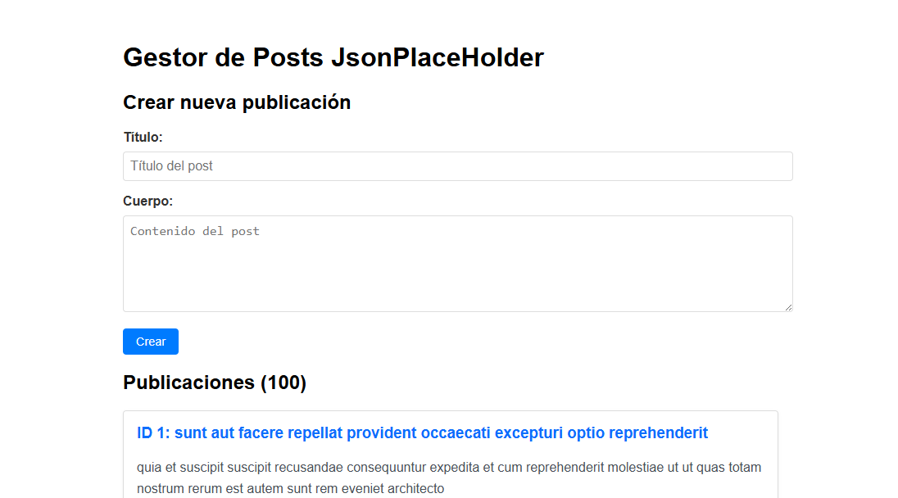

# 📘 CRUD en SvelteKit con JSONPlaceholder

Este proyecto implementa una aplicación CRUD (Create, Read, Update, Delete) de publicaciones usando SvelteKit y la API ficticia JSONPlaceholder.

## 🔧 Tecnologías utilizadas

- [SvelteKit](https://kit.svelte.dev)
- HTML/CSS
- JSONPlaceholder API
- Form Actions (`+page.server.js`)
- `load()` server-side
- `enhance()` para actualización sin recargar

---

## 🚀 Instrucciones de instalación

1. **Clonar el repositorio**:

```bash
git clone https://github.com/tu_usuario/sveltekit-jsonplaceholder-crud.git
cd sveltekit-jsonplaceholder-crud
```

2. **Instalar dependencias**:

```bash
npm install
```

3. **Ejecutar el servidor local**:

```bash
npm run dev
```

4. **Abrir en el navegador**:
   Visita `http://localhost:5173` (o el puerto mostrado).

---

## 📂 Estructura del proyecto

```
src/
├── routes/
│   └── +page.svelte          # Página principal CRUD
│   └── +page.server.js       # Lógica de carga y acciones
│   └── PostForm.svelte       # Formulario reutilizable
│   └── PostItem.svelte       # Item individual
```

---

## ✅ Funcionalidades implementadas

### 📄 Listar Publicaciones (Read)

- Se utiliza `load()` en `+page.server.js` para obtener los datos.
- Se muestran `ID`, `título` y `cuerpo`.

### ➕ Crear Publicación (Create)

- Formulario con `título` y `cuerpo`.
- Usa Form Actions con `enhance()` para evitar recarga.
- Validación obligatoria y mensaje de error si faltan campos.

### ✏️ Actualizar Publicación (Update)

- Cada `PostItem` tiene botón “Editar”.
- El formulario se llena con los datos actuales.
- Se usa `PUT` con `Form Actions` y se actualiza visualmente la lista.

### ❌ Eliminar Publicación (Delete)

- Cada `PostItem` tiene botón “Eliminar”.
- Se simula DELETE con JSONPlaceholder.
- Se actualiza la lista inmediatamente al eliminar.

### ⚠️ Validación

- Campos obligatorios.
- Uso de `fail(400)` y `errorMessage` en el formulario.

---

## 📸 Capturas sugeridas

1. Pantalla principal con lista de publicaciones 
2. Posts traidos de la Api [Vista Posts](./captura/publicaciones.PNG)
3. Formulario para agregar nueva publicación [Vista agregar](./captura/agrgar.PNG)
4. Validación de campos vacíos  [Vista validacion](./captura/validacion.PNG)
5. Edición de publicación activa [Vista edicion](./captura/editar.PNG)
6. Publicación eliminada exitosamente [Vista eliminacion](./captura/elimi8nar.PNG)

---

## 📌 Consideraciones

- La API JSONPlaceholder **no persiste cambios reales**.
- Se simula comportamiento agregando/eliminando desde el frontend.
- Ideal para evaluar conocimientos en SvelteKit y manejo de formularios.

---

## 👨‍🏫 Evaluación basada en rúbrica

| Criterio                  | Puntos |
| ------------------------- | ------ |
| CRUD completo             | 10     |
| Uso de `load` y `actions` | 4      |
| Estado y actualización UI | 3      |
| Validación y errores      | 2      |
| Organización del código   | 1      |
| **Total**                 | **20** |

---

## ✍️ Autor

**Gabriel Mendoza** — [github.com/tu_usuario](https://github.com/tu_usuario)

¡Gracias por revisar este proyecto!
